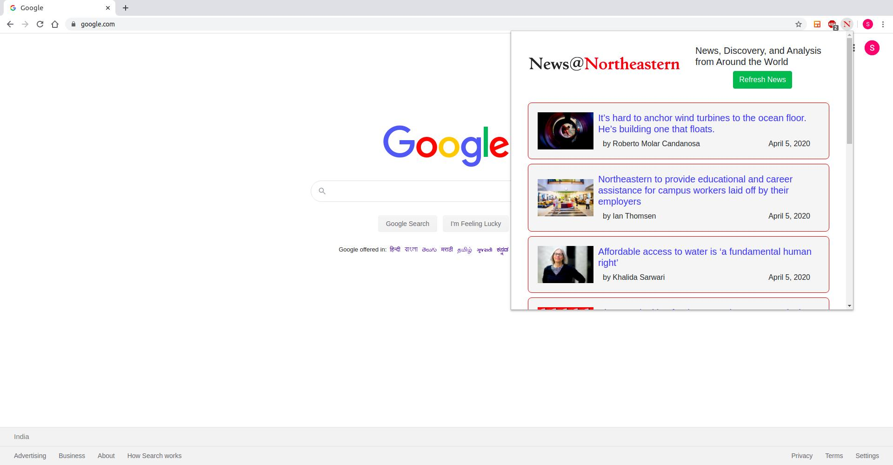
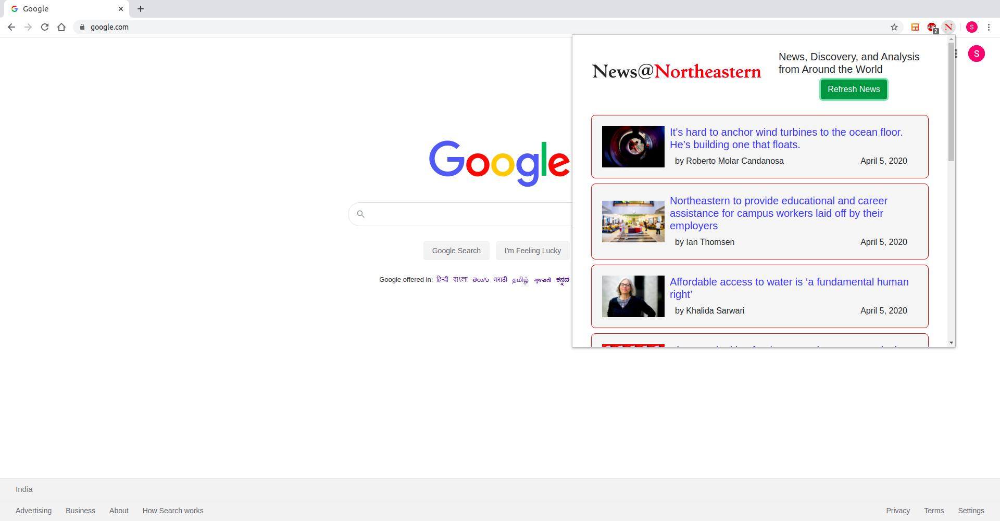
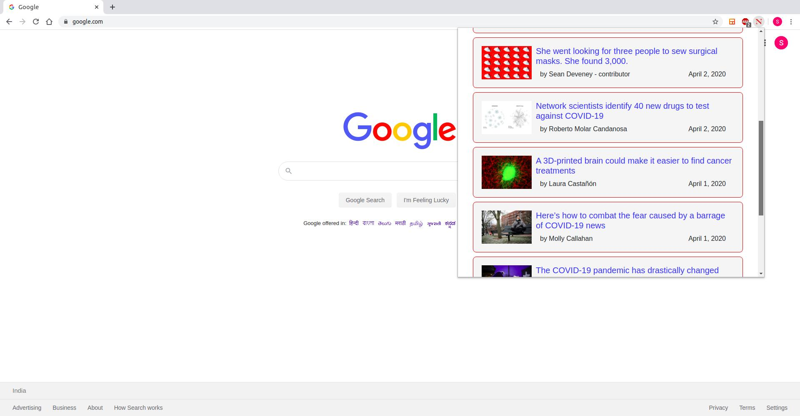
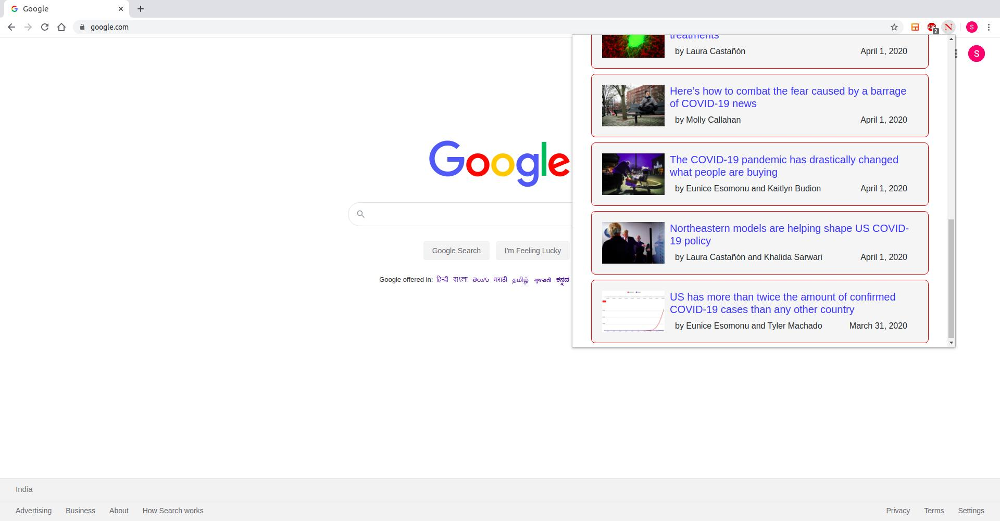
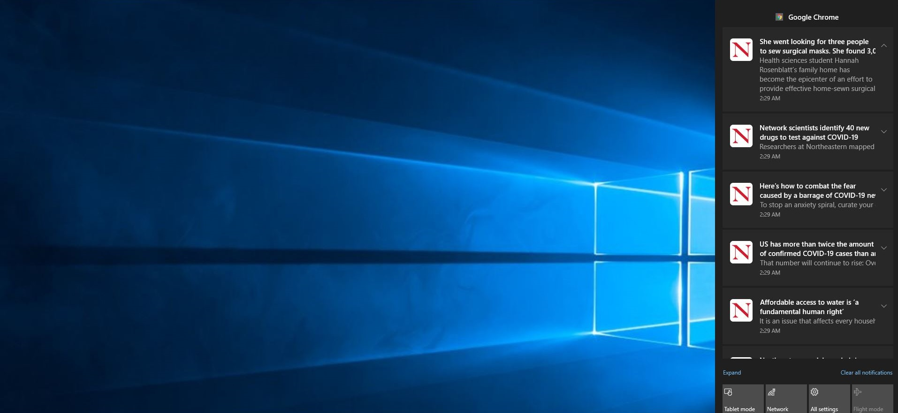

# News @ Northeastern

## What It Does?

**Northeastern** is a global, experiential, research university built on a tradition of engagement with the world, creating a distinctive approach to education and research.
This extension helps to get latest news from `News @ Northeastern` portal instantly. It will also generate a notification popup for any new article postings, as soon as article is posted on the portal or any new articles added since the last chrome session.

## Why is it needed?

The main motivation behind developing this productivity extension is to get notified about the latest news from **Northeastern** during COVID-19 time.
Every student (prospective/current) and may be faculty too, would be anxious to know about what's happening or going to happen within and outside the campus.
Of course, one can visit the News portal time to time to get updates but it's an additional task amidst our busy schedule.
Instead, if the updates can be notified instantly, then that would reduce the redundant visits to the portal and will help us utilize the saved valuable time for other important purposes.

### Features

1. Lists latest articles from `News @ Northeastern` portal.
2. Navigation to the latest articles from popup.
3. Interactive Scroll Bar inside popup.
4. Automatic notifications for latest article postings.
5. Refresh option when popup is open. (Generally not necessary. But, in case if there are new articles posted in the almost infinitesimal time interval when the popup is open, you can click this button to render articles appeared with in that time also.)

## Installation

I have added this extension to Chrome Web Store. But, it is still in review for "Broad Host Permissions" usage, which is needed to get content from `News @ Northeastern` portal. In the meanwhile, Ï am providing the `.crx` file as part of this repository.
Please note that the extension is completely safe and it does not ask you for any personal information. Also note that this extension does not send data to any websites.
It just gets data from `News @ Northeastern` portal.

Following are the steps to manually install a chrome extension from `.crx` package.

1. Download the `news-at-northeastern.crx` file to your computer from the [releases](../../releases) page.
2. Go to [chrome://extensions/](chrome://extensions/) in your browser and turn on the **Developer mode** option in the top right.
3. Use a CRX Extractor app -- I used [CRX Extractor](http://crxextractor.com/), to unpack the CRX file and turn it into a ZIP file.
4. Locate the ZIP file on your computer and unzip it.
5. Go back to the [chrome://extensions/](chrome://extensions/) in your browser and click the **Load unpacked** button on the top left and select the unzipped folder. Chrome will install the extension.

## How it Looks

|News After Load                        |News After Refresh                 |Popup Scrollbar Usage              |Popup Scrollbar end                |Chrome notifications                   |
|:-------------------------------------:|:---------------------------------:|:---------------------------------:|:---------------------------------:|:-------------------------------------:|
|          |   | |    ||

## Download
[Releases page](../../releases)

## License
See [LICENSE](./LICENSE) file

